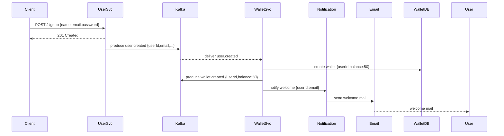
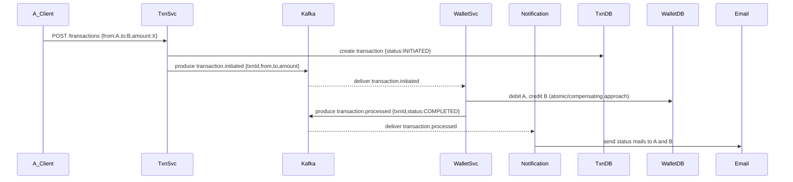

# Microservices Wallet System

> **A concise, production-minded microservices architecture for a digital wallet system**: user creation, automated wallet provisioning, transactions between users, Kafka event-driven synchronization and email notifications.

---

## Table of contents

1. [Project Overview](#project-overview)
2. [High-level Architecture](#high-level-architecture)
3. [Flow diagrams](#flow-diagrams)
4. [Services & responsibilities](#services--responsibilities)
5. [Event topics & payloads](#event-topics--payloads)
6. [DB schema (simplified)](#db-schema-simplified)
7. [Local setup & run](#local-setup--run)
8. [Testing & troubleshooting tips](#testing--troubleshooting-tips)
9. [Deployment & scaling notes](#deployment--scaling-notes)
10. [Credits & license](#credits--license)

---

## Project Overview

This repository demonstrates a small ecosystem of Spring Boot microservices collaborating to provide a digital wallet:

* **User Service** — manages user signup/login and emits `user.created` events.
* **Wallet Service** — consumes `user.created` to create a wallet with default ₹50, keeps balances, consumes `transaction.initiated` events to update balances and emits `transaction.processed` events.
* **Transaction Service** — creates transaction records (status: `INITIATED`) and emits `transaction.initiated` events.
* **Notification Service** — listens to wallet and transaction events and sends email notifications to users.

Core ideas: event-driven architecture (Kafka), eventual consistency, Spring Security for authentication/authorization, and clear separation of responsibilities.

## High-level Architecture

```mermaid
flowchart LR
  subgraph Client
    UI[User / Client]
  end

  subgraph Kafka[Kafka Cluster]
    KC1[(user.created)]
    KC2[(transaction.initiated)]
    KC3[(transaction.processed)]
    KC4[(wallet.updated)]
  end

  UI -->|HTTP| UserService[User Service (Spring Boot + Security)]
  UserService -->|produces user.created| KC1

  KC1 -->|consumed by| WalletService[Wallet Service]
  WalletService -->|persists wallet + emits wallet.updated| KC4
  WalletService -->|sends welcome mail| Notification[Notification Service]

  UI -->|HTTP| TransactionService[Transaction Service]
  TransactionService -->|produces transaction.initiated| KC2
  KC2 -->|consumed by| WalletService
  WalletService -->|process & emit transaction.processed| KC3
  KC3 -->|consumed by| Notification

  Notification -->|sends emails| Email[(SMTP / SES)]
```

## Flow diagrams

### 1) New user signup -> automatic wallet creation



### 2) Transaction flow (transfer ₹X from A -> B)



## Services & responsibilities

* **User Service**

  * REST APIs for signup/login/profile
  * Uses Spring Security (JWT or OAuth2) to protect endpoints
  * Publishes `user.created` event after successful registration

* **Wallet Service**

  * Maintains `wallets` table with `user_id`, `balance`, `currency`
  * Creates default wallet with balance ₹50 on `user.created`
  * Listens to `transaction.initiated` and updates balances
  * Publishes `wallet.updated` and `transaction.processed`
  * Important: implement idempotency (use message keys / consumer offsets) and optimistic locking or DB transactions when updating balances

* **Transaction Service**

  * Creates transactions with statuses `INITIATED`, `PROCESSING`, `COMPLETED`, `FAILED`
  * Emits `transaction.initiated` with minimal payload
  * Optionally exposes transaction history API

* **Notification Service**

  * Subscribes to wallet and transaction topics
  * Sends templated emails (welcome, debit, credit, failure)

## Event topics & sample payloads

* `user.created`

```json
{ "userId": "uuid-1234", "email": "alice@example.com", "name": "Alice" }
```

* `transaction.initiated`

```json
{ "txnId": "txn-9876", "from": "uuid-1234", "to": "uuid-2222", "amount": 150.0, "currency": "INR" }
```

* `transaction.processed`

```json
{ "txnId": "txn-9876", "status": "COMPLETED", "timestamp": "2025-08-12T10:22:00Z" }
```

## DB schema (simplified)

**wallets**

* id (uuid)
* user\_id (uuid) - unique
* balance (decimal)
* currency (string)
* created\_at, updated\_at

**transactions**

* id (uuid)
* from\_user (uuid)
* to\_user (uuid)
* amount (decimal)
* status (enum)
* created\_at, updated\_at

## Local setup & run (developer friendly)

1. Start dependencies (Kafka, Zookeeper, Postgres/ MySQL, Mailhog) — use Docker Compose (recommended).
2. Configure services via `application.yml` (Kafka brokers, datasource, mail, security secrets).
3. Run each service with `./mvnw spring-boot:run` or in your IDE.
4. Use Postman or curl to register user, trigger transactions, observe Kafka topics.

**Example docker-compose tip**: include `kafka`, `zookeeper`, `postgres`, and `mailhog` services; map topics in `init` script.

## Testing & troubleshooting tips

* Use **MailHog** or **Mailtrap** locally to inspect outgoing emails.
* For race conditions in wallets, prefer: (a) DB-level row locking (SELECT ... FOR UPDATE) inside a transaction, or (b) optimistic locking with version column + retry on conflict.
* Implement **idempotency** for Kafka consumers: store `message_id` or `txn_id` in a processed table to ignore duplicates.
* Use **consumer groups** and partitioning by `userId` to ensure ordering per user.
* Add health endpoints (`/actuator/health`) and monitor consumer lag (Kafka consumer group offsets).

## Deployment & scaling notes

* Scale Wallet Service and Transaction Service horizontally; ensure Kafka partitioning key is chosen to keep related events ordered (e.g., `userId` or `txnId`).
* Keep sensitive configs in vault or cloud secret manager; rotate keys.
* For high reliability, consider SAGA/compensation patterns when multi-step transactions span services.

## Useful commands (dev)

* Create Kafka topic: `kafka-topics --create --topic transaction.initiated --bootstrap-server localhost:9092 --partitions 3 --replication-factor 1`
* Consume topic: `kafka-console-consumer --topic wallet.updated --bootstrap-server localhost:9092 --from-beginning`

## Credits & license

Built with ❤️ using Spring Boot, Spring Security, Spring Kafka.

**License**: MIT

---

> If you want, I can also:
>
> * provide well-styled PlantUML diagrams or PNG exports,
> * create a `docker-compose.yml` template for this stack,
> * scaffold `application.yml` snippets for each service.

provide well-styled PlantUML diagrams or PNG exports,
