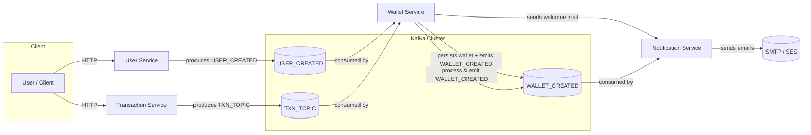
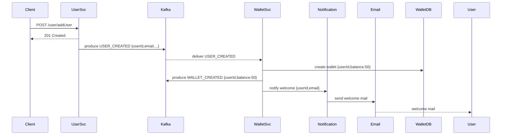
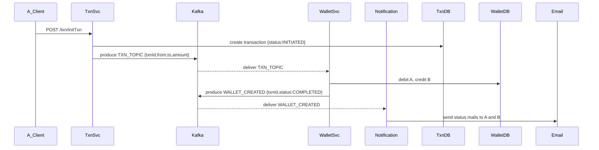

# Microservices Wallet System

> **A concise, production-minded microservices architecture for a digital wallet system**: user creation, automated wallet provisioning, transactions between users, Kafka event-driven synchronization and email notifications.

---

## Table of contents

1. [Project Overview](#project-overview)
2. [High-level Architecture](#high-level-architecture)
3. [Flow diagrams](#flow-diagrams)
4. [Services & responsibilities](#services--responsibilities)
5. [Event topics & payloads](#event-topics--payloads)
6. [DB schema (simplified)](#db-schema-simplified)
7. [Local setup & run](#local-setup--run)
8. [Testing & troubleshooting tips](#testing--troubleshooting-tips)
9. [Deployment & scaling notes](#deployment--scaling-notes)
10. [Credits & license](#credits--license)

---

## Project Overview

This repository demonstrates a Spring Boot microservices ecosystem for a digital wallet:

- **User Service** — manages user signup/login and emits `USER_CREATED` events.
- **Wallet Service** — consumes `USER_CREATED` to create a wallet with default ₹50, manages balances, consumes `TXN_TOPIC` events to update balances, and emits `WALLET_CREATED` events.
- **Transaction Service** — creates transaction records (status: `INITIATED`) and emits `TXN_TOPIC` events.
- **Notification Service** — listens to wallet and user events and sends email notifications.
- **Utils Module** — shared constants and utilities.

Core ideas: event-driven architecture (Kafka), eventual consistency, Spring Security for authentication/authorization, and clear separation of responsibilities.

## High-level Architecture



## Flow diagrams

### 1) New user signup -> automatic wallet creation



### 2) Transaction flow (transfer ₹X from A -> B)



## Services & responsibilities

### User Service

- REST APIs for signup/login/profile
- Uses Spring Security for authentication/authorization
- Publishes `USER_CREATED` event after successful registration

### Wallet Service

- Maintains `wallets` table with `userId`, `balance`, `contact`
- Creates default wallet with balance ₹50 on `USER_CREATED`
- Listens to `TXN_TOPIC` and updates balances
- Publishes `WALLET_CREATED` event

### Transaction Service

- Creates transactions with statuses `INITIATED`, `SUCCESS`, `FAILED`
- Emits `TXN_TOPIC` with transaction details

### Notification Service

- Subscribes to wallet and user topics
- Sends templated emails (welcome, debit, credit, failure)

### Utils Module

- Shared constants for event topics and field names

## Event topics & sample payloads

- `USER_CREATED`

```json
{ "userId": 1, "email": "alice@example.com", "name": "Alice", "contact": "9876543210" }
```

- `TXN_TOPIC`

```json
{ "txnId": "txn-9876", "sender": "9876543210", "receiver": "9123456780", "amount": 150.0, "note": "Payment" }
```

- `WALLET_CREATED`

```json
{ "userId": 1, "WALLET_BALANCE": 50.0 }
```

## DB schema (simplified)

**wallets**

- id (auto-increment)
- userId (int)
- balance (decimal)
- contact (string)
- createdOn, updatedOn

**users**

- id (auto-increment)
- contact (string, unique)
- email (string, unique)
- password (string)
- authorities (string)
- name, address, dob, identifier, identifierValue, userType
- createdOn, updatedOn

**transactions**

- id (auto-increment)
- txnId (string)
- amount (decimal)
- sender (string)
- receiver (string)
- note (string)
- status (enum)
- createdOn, updatedOn

## Local setup & run

1. Start dependencies (Kafka, Zookeeper, MySQL, Mailhog) — use Docker Compose (recommended).
2. Configure each service via `application.properties` (Kafka brokers, datasource, mail, security secrets).
3. Run each service with `./mvnw spring-boot:run` or in your IDE.
4. Use Postman or curl to register users, trigger transactions, observe Kafka topics.

## Testing & troubleshooting tips

- Use **MailHog** or **Mailtrap** locally to inspect outgoing emails.
- For wallet updates, use DB transactions or optimistic locking to avoid race conditions.
- Implement idempotency for Kafka consumers: store `txnId` in a processed table to ignore duplicates.
- Use consumer groups and partitioning by `userId` to ensure ordering per user.
- Add health endpoints (`/actuator/health`) and monitor consumer lag (Kafka consumer group offsets).

## Deployment & scaling notes

- Scale Wallet Service and Transaction Service horizontally; ensure Kafka partitioning key is chosen to keep related events ordered (e.g., `userId` or `txnId`).
- Keep sensitive configs in vault or cloud secret manager; rotate keys.
- For high reliability, consider SAGA/compensation patterns when multi-step transactions span services.

## Useful commands (dev)

- Create Kafka topic:  
  `kafka-topics --create --topic TXN_TOPIC --bootstrap-server localhost:9092 --partitions 3 --replication-factor 1`
- Consume topic:  
  `kafka-console-consumer --topic WALLET_CREATED --bootstrap-server localhost:9092 --from-beginning`

## Credits & license

Built with ❤️ using Spring Boot, Spring Security, Spring Kafka.

**License**: MIT

---

> If you want, I can also:
>
> * provide well-styled PlantUML diagrams or PNG exports,
> * create a `docker-compose.yml` template for this stack,
> * scaffold `application.yml` snippets for each service.
